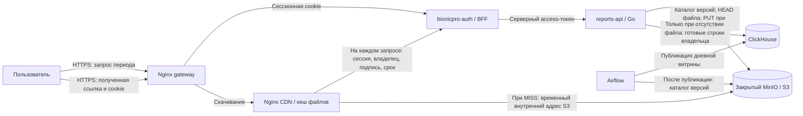

# Хранение и доставка отчётов BionicPRO

Источники и расчёт показателей переведены на [CDC](../Task4/architecture.md).
Ниже описана действующая доставка неизменных версий через S3/CDN.

Пользователь запрашивает отчёт за период, получает временную ссылку и скачивает
готовый JSON через CDN — сеть доставки содержимого, которую в стенде имитирует
Nginx. Первый запрос формирует файл из витрины ClickHouse; повторные используют
S3 — объектное хранилище MinIO. Управление протезом и распознавание движений
остаются на чипе и не зависят от этого процесса.

Решение развивает [витрину и проверку владения](../Task2/architecture.md).
Сервис отчётов остаётся на Go. Сессионная cookie браузера имеет флаги
HttpOnly и Secure; токены Keycloak получает только серверная часть интерфейса
(BFF, backend for frontend). Данные, S3 и кеш CDN размещаются в том же
региональном контуре, что CRM и ClickHouse.
JWT — подписанный access-токен с идентификатором пользователя `sub`;
UTC — единое время, по которому определяются границы дней отчёта.



`HEAD` проверяет наличие объекта без чтения его содержимого; `PUT` сохраняет
объект целиком. `MISS` означает загрузку из S3, `HIT` — выдачу готового файла
из кеша Nginx. Стрелка проверки доступа выполняется и при `HIT`.

## Каталог опубликованных версий

После записи и проверки CDC-версий задача Airflow `publish_cdc` вызывает
`publish_catalog`. Функция читает реестр `cdc_report_periods FINAL`
в ClickHouse и записывает `catalog/cdc-current.json` в S3.
Каталог содержит номер схемы `1`, дни UTC,
`batch_id` и время публикации. Профили, идентификаторы пациентов и показатели
протезов в каталог не входят.

Замена одного объекта S3 атомарна: читатель видит старый или новый JSON целиком.
Задача сначала получает ETag — идентификатор содержимого старого каталога, —
затем читает реестр ClickHouse и сохраняет объект с условием `If-Match`.
Для первого каталога используется `If-None-Match: *`. Это предотвращает
перезапись новой публикации запоздавшим параллельным запуском. Конфликт или
сбой S3 завершает задачу ошибкой; повторная попытка заново читает обе стороны.

Между записью ClickHouse и S3 общей транзакции нет. Пока каталог не обновлён,
запросы используют предыдущие опубликованные версии. DAG считается успешным
только после обновления S3; за его состоянием нужно следить. При отсутствии
каталога или отказе S3 API отвечает `503`, без обходного чтения ClickHouse.
При переходе на CDC публикуется отдельный каталог; прежние версии ETL
не используются новым API.

## Ключ объекта и генерация

Файлы размещаются по ключу:

```text
reports/v1/<owner>/<from>_<to>/<version>.json
```

- `owner` — HMAC-SHA256 от `owner:` и проверенного `sub` пользователя.
  HMAC — хеш с секретным ключом; ID аккаунта и имя не раскрываются в адресе.
- `from` и `to` — границы UTC: начало включается, конец исключается,
  максимум 31 день, как в задании 2.
- `version` — SHA256 от упорядоченного списка выбранных дневных версий,
  включая день, `batch_id` и время публикации. `v1` фиксирует формат файла.
  При изменении состава/формата отчёта нужно увеличить эту версию.

Каждый запрос проходит проверку JWT Keycloak, затем читает каталог S3.
Если отсутствует хотя бы один день, возвращается `409` с `missing_days`.
Сервис вычисляет ключ и проверяет объект в S3. Наличие файла позволяет сразу
вернуть ссылку: запросов к ClickHouse нет, в том числе к реестру версий.

При отсутствии файла сервис читает готовые строки ClickHouse по подписанному
`sub` и ровно выбранным `batch_id`. JSON сохраняется синхронным `PutObject`
без составной загрузки; ссылка выдаётся после успешной записи.
Ошибки разрешений S3 и сетевые сбои не считаются отсутствием объекта.
Пустой отчёт также сохраняется, с пустым `rows`.

Одновременные запросы одного ключа объединяются через `singleflight` — одна
генерация с ожиданием результата другими запросами. После получения права
генерации наличие объекта проверяется повторно. В одном экземпляре Go не
более восьми генераций одновременно; ожидание и работа ограничены 25 секундами.
Отмена одного HTTP-запроса не прерывает общую генерацию. Сервис локального
стенда один; между несколькими экземплярами общей блокировки нет.

## Контракт API и проверка скачивания

Публичные `GET /api/reports` и `/reports` возвращают метаданные:

```json
{
  "from": "2026-09-28",
  "to": "2026-10-01",
  "timezone": "UTC",
  "download_url": "/cdn/reports/v1/<owner>/<period>/<version>.json?expires=<unix>&signature=<hmac>",
  "expires_at": 1790884800
}
```

JSON-файл содержит исходные `from`, `to`, `timezone`, `periods` и `rows`.
React получает данные в два запроса: сначала ссылку у API, затем файл с CDN.
Параметры `user_id`/`subject` и повторные параметры по-прежнему запрещены.

Ссылка действует пять минут. Её подпись связывает полный путь и срок действия.
Она **дополнительно требует действующую сессию владельца**: передать ссылку
другому пользователю недостаточно для доступа. На каждом запросе Nginx делает
`auth_request` в BFF; BFF проверяет и обновляет сессию, а Go проверяет JWT,
владельца пути, подпись и срок. Некорректная ссылка даёт `403`, отсутствие
сессии — `401`. Проверка не читает ClickHouse и не кешируется.

Go выдаёт в служебном заголовке подписанный адрес чтения S3 на одну минуту.
Nginx использует его как origin — источник файла при `MISS`. Ни заголовок,
ни адрес S3, ни учётные данные S3 не передаются браузеру. Cookie после ротации
BFF возвращается браузеру через ответ CDN, включая отказ в доступе.
Публичный gateway закрывает `/internal/`; служебный location CDN — `internal`.

## Кеш Nginx и обновление

Ключ кеша — `$uri`: путь с владельцем, периодом и версией. Подпись, срок ссылки
и cookie не создают дополнительные копии. В кеш попадают только успешные
ответы `200`, на 24 часа; максимум дискового кеша — 256 МиБ. Неиспользуемые
сутки файлы удаляются. `proxy_cache_lock` объединяет одновременные промахи
на стороне CDN; ошибки авторизации и S3 не сохраняются как отчёты.

Изменение показателей дня или явная повторная публикация получает новый
`batch_id`, обновляет каталог и меняет путь отчёта. Неизменные дни сохраняют
версии при обычном минутном запуске. Новая ссылка автоматически обходит старую
копию CDN; очистка всего кеша и перезапись пользовательских файлов не нужны. Уже выданная ссылка
относится к неизменному снимку и действует до окончания своих пяти минут.
Удаление старого файла в S3 само по себе не очищает его копию CDN.

Для браузера ответ имеет `Cache-Control: private, no-store`, чтобы общий
дисковый кеш устройства не сохранял медицинские отчёты. Это не препятствует
серверному кешу Nginx: S3 возвращает отдельную политику хранения файла.
React последовательно выполняет запросы с cookie; кнопка скачивания получает
свежую ссылку и сохраняет фактический ответ CDN в JSON.

## Доступ к хранилищу и ограничения

Бакет закрыт для анонимного чтения; MinIO, CDN и Go не публикуют порты на хост.
Внешний доступ к отчётам проходит только через HTTPS gateway.
Отдельная внутренняя сеть `storage` соединяет
MinIO, Go, Airflow и CDN. API может читать каталог/файлы и писать только
`reports/*`; Airflow читает и пишет только два разрешённых каталога:
старый `catalog/current.json` и действующий `catalog/cdc-current.json`.
Корневая учётная запись MinIO используется только сервисом и инициализатором.
Секреты создаёт `prepare-local.py`, они хранятся в игнорируемом `.env`.
Логи Nginx не содержат query string, cookie, подпись ссылки или токены.

- Каталог читается целиком на каждый запрос, ограничен 1 МиБ. Для большой
  истории понадобятся каталоги по месяцам. S3 остаётся зависимостью выдачи
  новых ссылок; при отказе S3 уже прогретый CDN может выдать ещё действующую
  ссылку, пока работают BFF и Go, поскольку подпись S3 формируется локально.
- Файл ограничен существующими лимитами чтения ClickHouse: 10 000 строк,
  256 МиБ памяти запроса и 8 секунд. Кеш снижает повторные чтения, но не
  удешевляет первое формирование нового периода или работу ETL.
- Старые отчёты и версии витрины сохраняются. Сроки хранения, удаление по
  запросу пользователя и согласованная очистка S3/CDN требуют отдельного
  регламента. Смена `REPORT_LINK_KEY` отзывает ссылки и меняет owner-префиксы.
- Доступ к тёплому кешу зависит от BFF/Go. Общая блокировка сессий BFF
  сохраняется; добавлен сетевой запрос проверки скачивания. Для масштабирования
  нужны отдельные блокировки сессий и общее хранилище сессий.
- MinIO в стенде работает с одним томом, CDN — с одним узлом. Внутренние HTTP
  соединения не шифруются. Это локальная демонстрация; резервирование,
  внутренний TLS и промышленная политика удаления здесь не реализованы.
- MinIO и `mc` собираются из фиксированных официальных исходников.
  Первая сборка требует сети, времени,
  места для Go-модулей и памяти для компиляции; кеш компиляции MinIO временно
  размещается в памяти.

Технические источники: [MinIO Go SDK](https://github.com/minio/minio-go/blob/master/docs/API.md),
[Nginx auth_request](https://nginx.org/en/docs/http/ngx_http_auth_request_module.html),
[Nginx proxy_cache](https://nginx.org/en/docs/http/ngx_http_proxy_module.html),
[условная запись S3](https://docs.aws.amazon.com/AmazonS3/latest/userguide/conditional-writes.html),
[Boto3 put_object](https://docs.aws.amazon.com/boto3/latest/reference/services/s3/client/put_object.html).
