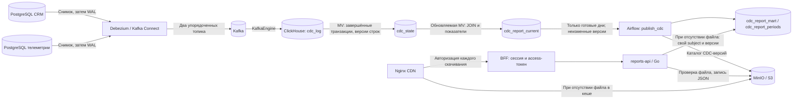

# Поток изменений CRM и витрина отчётности BionicPRO

CRM — система работы с клиентами — хранит клиентов, модели протезов
и историю владения в PostgreSQL.
Массовая выгрузка этих таблиц конкурирует с транзакционными запросами CRM.
Для разделения потоков Debezium один раз читает начальный снимок, затем
передаёт изменения из журнала PostgreSQL в Kafka. ClickHouse рассчитывает
показатели, Airflow публикует готовые дни, API на Go выдаёт отчёты.
Airflow и API не подключаются к исходным PostgreSQL и не имеют их паролей.

CDC (Change Data Capture) — получение изменений данных после их фиксации.
OLTP — короткие транзакционные операции CRM; OLAP — аналитическая обработка
в ClickHouse. WAL — журнал изменений PostgreSQL. LSN — числовая позиция
записи в этом журнале. API — программный интерфейс сервиса; BFF — серверная
часть интерфейса пользователя, проверяющая сессию и передающая токен API.
Работа протеза на чипе не зависит от доставки отчётов.

MV (materialized view) — представление, сохраняющее результат запроса
в таблицу. Обновляемая MV полностью пересчитывает результат и атомарно
заменяет его: читатель получает прежний либо новый набор строк целиком.
Для API результат дополнительно сохраняется как неизменная версия дня.
S3 — объектное хранилище; CDN — кеш доставки файлов. Схема доставки и
проверки владельца описана в [архитектуре хранения отчётов](../Task3/architecture.md).

## Захват изменений

[Compose](../docker-compose.yaml) запускает Kafka 4.0.0 в режиме KRaft,
то есть с собственным контроллером метаданных без ZooKeeper, и Kafka Connect
с Debezium 3.2.1.Final. Постоянный том Kafka хранит сообщения и служебные
топики Connect. PostgreSQL использует `wal_level=logical` и `pgoutput` —
встроенный протокол логической репликации.

Отдельный аккаунт `debezium` получает право репликации и чтения только
захватываемых таблиц. Он может обновлять единственную служебную строку
`cdc_control`; права изменения клиентов, владения или событий ему не нужны.
Инициализатор создаёт публикацию `bionicpro_cdc` от владельца БД, а коннектор
использует `publication.autocreate.mode=disabled`. Пароли передаются через
провайдер переменных окружения Connect и отсутствуют в JSON-файлах.

| Источник | Захватываемые таблицы | Конфигурация | Топик |
| --- | --- | --- | --- |
| CRM | `customers`, `prostheses`, `ownership`, `export_checkpoint`, `cdc_control` | [crm-connector.json](../debezium/crm-connector.json) | `crm.events` |
| Телеметрия | `telemetry`, `export_checkpoint`, `cdc_control` | [telemetry-connector.json](../debezium/telemetry-connector.json) | `telemetry.events` |

CDC обоих источников позволяет целиком рассчитывать отчёт в ClickHouse.
Каждый PostgreSQL имеет собственный слот `bionicpro_cdc`: он хранит позицию
чтения и удерживает ещё не переданные записи журнала.

Первичный ключ `ownership` — `(prosthesis_id, valid_from)`; его добавление
сохраняет допустимую историю владения. `REPLICA IDENTITY FULL` передаёт
полную прежнюю строку при обновлении и удалении, включая длинные значения.
Миграции работают с новыми и существующими томами без удаления данных.

`snapshot.mode=initial` захватывает существующие строки; обычный перезапуск
продолжает чтение с сохранённой позиции. Для начального снимка нужно выбрать
окно запуска: он читает CRM. Затем остаётся нагрузка записи WAL и репликации.

Каждый топик имеет одну партицию — упорядоченную очередь сообщений.
Преобразование `RegexRouter` направляет в неё и строки всех таблиц источника,
и сообщения `BEGIN`/`END`. Подтверждение `acks=all`, защита производителя
от дубликатов и один незавершённый запрос сохраняют порядок при повторной отправке.
Топики данных используют удаление по сроку хранения, а не уплотнение по ключу:
для проверки транзакций нужны все события. Служебные топики Connect
уплотняются, сохраняя последние конфигурации и позиции.

## Приём и согласованность ClickHouse

[SQL-схема](../clickhouse/cdc.sql) содержит всю цепочку приёма и расчёта.

1. `cdc_kafka`, таблица с движком KafkaEngine, читает два топика как JSONAsString.
   `cdc_ingest`, обычная MV, сохраняет исходный JSON, топик, партицию и позицию
   Kafka в долговечный `cdc_log`. Прямое чтение Kafka-таблицы не используется.
2. `cdc_complete_transactions` проверяет наличие `BEGIN`, `END` и всех
   уникальных порядковых номеров событий, заявленных в `event_count`.
   В Debezium 3.2 LSN-суффикс ID различается между сообщениями; связь строится
   по номеру транзакции и диапазону LSN. Диапазон также различает повторное
   использование номера после его переполнения. Неполная транзакция остаётся
   в журнале, пока не поступят недостающие сообщения.
3. `cdc_state_mv` раз в 10 секунд заменяет таблицу последних состояний строк.
   Функция `argMax` выбирает последнее значение по LSN, порядку события и позиции Kafka.
   Повтор доставки не увеличивает показатели; запоздалое старое событие
   не отменяет более новое обновление. Удаление хранится как признак последней
   версии. `TRUNCATE` отсекает состояния таблицы до его LSN.
4. Представления клиентов, протезов, владения и телеметрии исключают удалённые
   строки. `cdc_report_current_mv` зависит от завершения `cdc_state_mv` и
   заново соединяет таблицы (JOIN) и рассчитывает показатели. Изменение модели
   или владельца влияет на отчёт без нового события телеметрии.

KafkaEngine подтверждает порцию после сохранения в журнале; после сбоя
возможна повторная доставка. Выбор последнего состояния строки исключает
двойной учёт. Неразбираемый JSON останавливает приём: ошибочные сообщения
не пропускаются.

Обычная MV с JOIN реагирует только на вставку и не учитывает изменения
справочника в прежних результатах. Поэтому выбрана обновляемая MV с полным
пересчётом. Массовая выгрузка из CRM устранена, но нагрузку ClickHouse
нужно измерять и контролировать.

## Показатели и готовность дня

Одна строка отчёта соответствует `(subject, day, prosthesis_id)`. `subject`
связывает клиента с ID аккаунта Keycloak. День определяется в UTC — едином
времени без местных смещений. Владение действует в полуоткрытом интервале
`[valid_from, valid_to)`: событие на границе передачи относится новому владельцу.

Витрина считает число измерений, сумму движений, число ошибок, средний и
максимальный отклик, минимальный заряд. Запасной протез без измерений получает
нулевые счётчики и `null` для отклика/заряда. После удаления измерения оно
исчезает из следующего пересчёта. Пересчёт охватывает завершённые дни начиная
с 1 января 2026 года, принятой начальной даты учебной отчётности.

`cdc_report_current` содержит строки показателей и одну служебную строку
готовности на день. Они создаются одним обновлением MV. Airflow читает их
одним запросом, поэтому готовность и показатели относятся к одной версии
этой таблицы. Служебные строки в JSON пользователя не попадают.

Готовность требует одновременно:

- контрольных отметок `export_checkpoint.closed_through` из обоих источников,
  покрывающих весь день, в том числе пустой;
- heartbeat обоих источников не старше двух минут;
- отсутствия событий дня без единственного владельца, клиента и модели;
- корректных обязательных полей и времён в последнем состоянии строк.

Heartbeat — служебное подтверждение работающего потока. Каждые пять секунд
Debezium обновляет `cdc_control.touched_at` после начала потоковой работы.
Готовность требует именно потокового создания или обновления этой строки;
её запись из начального снимка не разрешает публикацию независимо от времени.
Два источника не имеют общей транзакции. При запаздывании истории владения обнаруженный
разрыв запрещает новую публикацию, а прежняя версия остаётся доступной.
Полнота бизнес-данных всё равно зависит от достоверности контрольных отметок.

## Публикация, API и кеш

[Граф задач Airflow (DAG) `bionicpro_reports`](../airflow/dags/report_etl.py) имеет одну задачу
`publish_cdc`, выполняемую каждую минуту. Она обновляет и дожидается MV,
читает готовую OLAP-таблицу и проверяет изменения содержимого дней по SHA256 —
криптографическому отпечатку данных.
Повторяются последний завершённый день и все уже опубликованные дни:
исправление старой записи не требует ручного пересчёта. Другую историю
можно добавить запуском с параметром `day`.

Изменившийся день получает новый UUID — уникальный идентификатор `batch_id`.
Строки синхронно записываются порциями до 10 000 в `cdc_report_mart`;
их число проверяется перед записью в реестр `cdc_report_periods`.
Пустой готовый день публикуется с нулевым числом строк.
Неизменные дни сохраняют версии и кеш. Явный параметр `day` принудительно
создаёт новую версию этого дня даже при неизменных показателях.

После публикации Airflow атомарно обновляет `catalog/cdc-current.json` в S3
с проверкой ETag — идентификатора прежнего содержимого. Старый каталог
`catalog/current.json` и пакетная витрина сохраняются отдельно; новые UUID
и новый каталог исключают смешивание пакетных и CDC-версий. После сбоя S3
запись каталога повторяется на следующем запуске, даже если показатели не изменились.

[Go API](../reports-api/cache.go) использует исключительно CDC-каталог и
`cdc_report_mart`, фильтруя строки по проверенному `sub` токена и выбранным
UUID версий. При наличии JSON в S3 запросы ClickHouse не выполняются.
Изменение версии меняет путь файла и обходит прежний кеш CDN. Уже выданная
ссылка сохраняет свой снимок на пять минут и требует сессию владельца.

Airflow ограничивает активные запуски DAG одним. Ручные запуски направляются
через scheduler командой `dags trigger`; `dags test` нужно запускать при
отсутствии другого издателя. Между ClickHouse и S3 нет общей транзакции:
до успешной записи каталога API использует предыдущую публикацию.

## Изоляция и ограничения

Сети `crm-source` и `telemetry-source` соединяют только соответствующую БД,
Connect, инициализатор и инструмент заполнения демоданных. В них нет Airflow,
Go API или браузера. ClickHouse соединён с Kafka через сеть `cdc`, а API
читает ClickHouse через `analytics`. Внешних портов у Kafka, Connect и
исходных БД нет. Витрина и журналы должны оставаться в регионе обслуживания
пациента; сырой журнал также содержит чувствительные данные.

| Ограничение | Следствие и дальнейшее решение |
| --- | --- |
| Начальный снимок и `REPLICA IDENTITY FULL` | Разовое чтение и увеличенный WAL остаются; измерить влияние при запуске на реальной CRM |
| Один брокер и одна партиция на источник | Нет отказоустойчивости к потере узла; для эксплуатации нужны репликация и проверка порядка/границ при масштабировании |
| Полный журнал и пересчёт раз в 10 секунд | Стоимость растёт с историей; нужны измерения, снимки состояния и безопасная очистка журнала, либо отдельная стратегия обновления затронутых ключей |
| Все опубликованные дни в памяти Airflow | История и число клиентов увеличивают память/время; разбивать публикацию и каталоги по периодам после измерений |
| Kafka хранит события семь дней; WAL ограничен 1 ГБ на слот | Длительный простой может потребовать нового снимка; контролировать отставание и валидность слотов |
| Нет распределённого снимка двух источников | Бизнес-полноту задают источники; совместно согласовать закрытие дней и обработку поздних исправлений |
| Старые версии и кеш остаются | Удаление из источника меняет будущий отчёт, но не удаляет исторические файлы; нужен регламент очистки витрины, S3, CDN и резервных копий |
| Локальные внутренние соединения без TLS | Перед эксплуатацией добавить шифрование, права Kafka, секрет-хранилище, резервирование и мониторинг |

Потерю слота, Kafka-offset или журнала нельзя исправлять независимым сбросом
одного компонента: новый снимок не содержит удалённые за время простоя строки.
Восстановление требует согласованного нового поколения CDC с полным начальным
снимком и переключением после проверки; опубликованные файлы можно сохранить.
Шаги диагностики — в [инструкции по CDC](cdc-diagnostics.md#диагностика-и-восстановление).

## Технические источники

- [Debezium 3.2: PostgreSQL, снимки, права, события и транзакции](https://debezium.io/documentation/reference/3.2/connectors/postgresql.html).
- [Apache Kafka 4.0: официальный Docker-образ](https://kafka.apache.org/40/getting-started/docker/).
- [ClickHouse: KafkaEngine и доставка через MV](https://clickhouse.com/docs/engines/table-engines/integrations/kafka).
- [ClickHouse: обновляемые materialized view](https://clickhouse.com/docs/materialized-view/refreshable-materialized-view).
